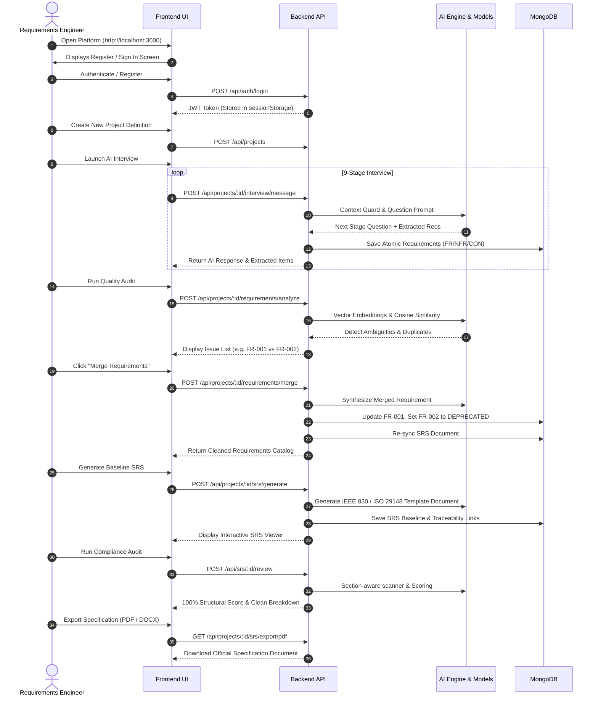
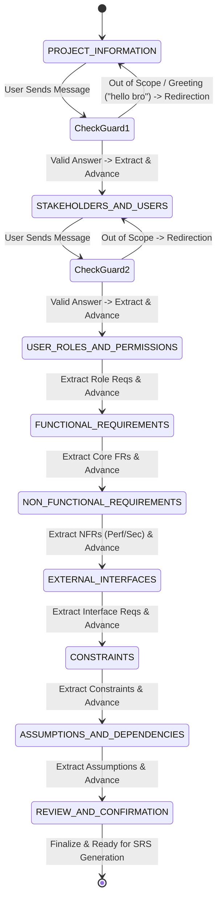
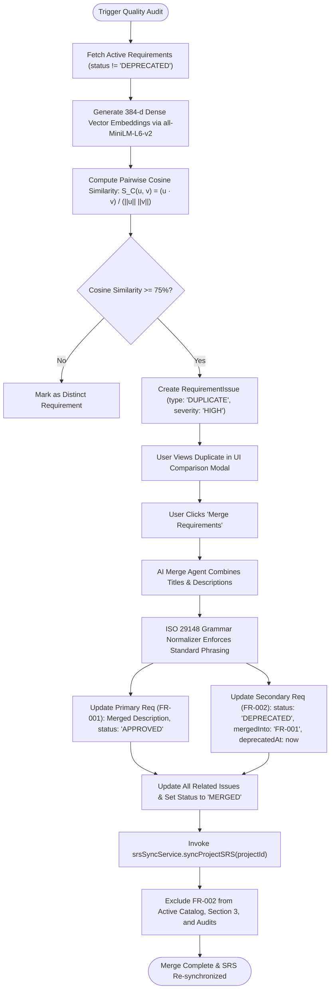
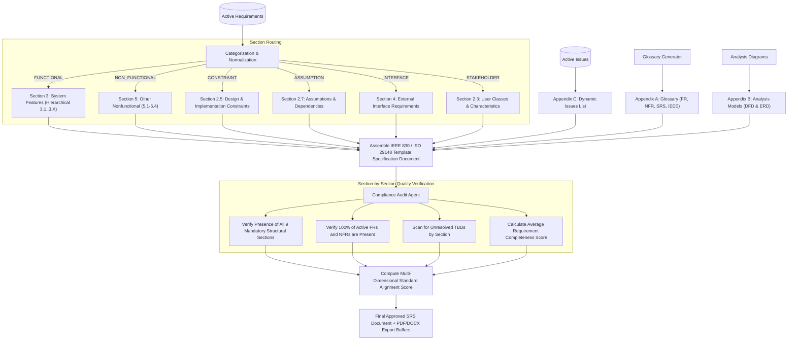

# IntelliSDLC AI — Complete Technical Implementation & Architecture Guide

> **Enterprise AI-Powered Software Requirements Engineering Platform**  
> *Aligned with ISO/IEC/IEEE 29148:2018 and IEEE 830-1998 Standards*

---

## Table of Contents

1. [System Overview & Architecture](#1-system-overview--architecture)
2. [End-to-End Operational Workflow (How the Website Works)](#2-end-to-end-operational-workflow-how-the-website-works)
3. [Core Algorithms & Mathematical Models](#3-core-algorithms--mathematical-models)
   - 3.1 [Dense Vector Embedding & Cosine Similarity Algorithm](#31-dense-vector-embedding--cosine-similarity-algorithm)
   - 3.2 [ISO/IEC/IEEE 29148 Grammar Normalization Engine](#32-isoicieee-29148-grammar-normalization-engine)
   - 3.3 [Retrieval-Augmented Generation (RAG) Context Engine](#33-retrieval-augmented-generation-rag-context-engine)
   - 3.4 [Multi-Dimensional Compliance Scoring Algorithm](#34-multi-dimensional-compliance-scoring-algorithm)
   - 3.5 [Idempotent SRS Synchronization & Graph Propagation](#35-idempotent-srs-synchronization--graph-propagation)
   - 3.6 [AI Requirement Merge & Historical Deprecation Algorithm](#36-ai-requirement-merge--historical-deprecation-algorithm)
   - 3.7 [Finite State Machine Stage-Gate Interview Agent](#37-finite-state-machine-stage-gate-interview-agent)
   - 3.8 [Semantic Atomic Decomposition & Clause Extraction Algorithm](#38-semantic-atomic-decomposition--clause-extraction-algorithm)
4. [System Flowcharts & Visual Architecture](#4-system-flowcharts--visual-architecture)
   - 4.1 [High-Level System Architecture](#41-high-level-system-architecture)
   - 4.2 [End-to-End User Journey Workflow](#42-end-to-end-user-journey-workflow)
   - 4.3 [AI Interview & Context Guard State Machine](#43-ai-interview--context-guard-state-machine)
   - 4.4 [Duplicate Detection & Merge Resolution Engine](#44-duplicate-detection--merge-resolution-engine)
   - 4.5 [Exact-Template SRS Generation & Audit Pipeline](#45-exact-template-srs-generation--audit-pipeline)
5. [Database Schema & Data Models](#5-database-schema--data-models)
6. [API Route Hierarchy & Micro-Services](#6-api-route-hierarchy--micro-services)
7. [How to Run, Test, and Deploy the System](#7-how-to-run-test-and-deploy-the-system)

---

## 1. System Overview & Architecture

IntelliSDLC AI is a full-stack platform designed to automate and formalize the Software Requirements Engineering lifecycle. It transforms unstructured stakeholder ideas into structured, atomic, duplicate-free, and IEEE/ISO-compliant Software Requirements Specifications (SRS).

### Technology Stack
- **Frontend**: Next.js 14 (App Router), React 18, Tailwind CSS, Lucide Icons, Axios.
- **Backend**: Node.js, Express.js REST API layer, JWT & bcrypt authentication.
- **Database**: MongoDB (Mongoose ODM) with replica support for transactional persistence.
- **AI & Embedding Engines**:
  - Local LLM: Ollama (`codellama:7b-instruct` / `llama3`).
  - Local Vector Embeddings: HuggingFace Transformers (`@xenova/transformers` - `all-MiniLM-L6-v2` 384-dimensional dense vectors).
- **Export Engines**: `docx` (Word Documents), `pdfkit` (Adobe PDF Generator).

```
+-----------------------------------------------------------------------------------+
|                                 FRONTEND (Next.js 14)                             |
|  [Landing Page] -> [Auth: Session-Scoped] -> [Dashboard] -> [Project Workbench]   |
|  - AI Interview Chat (Stage-Gated)  - Requirements Catalog & Normalizer           |
|  - Quality Audit & Duplicate Merge  - Interactive SRS Viewer & PDF/DOCX Export    |
+------------------------------------------+----------------------------------------+
                                           | HTTP / REST (JWT in SessionStorage)
+------------------------------------------v----------------------------------------+
|                             BACKEND API LAYER (Express.js)                        |
|  - Auth & Project Controller        - Requirement & Sync Controller               |
|  - Interview Session Controller     - Analysis & Merge Controller                 |
|  - SRS & Version Controller         - Export Service (PDF/DOCX)                   |
+------------------------------------------+----------------------------------------+
                                           |
      +------------------------------------+-----------------------------------+
      |                                    |                                   |
+-----v-------------------+      +---------v--------------+      +-------------v----+
|   AI AGENT PIPELINE     |      |   DATA & VECTOR LAYER  |      | GRAMMAR & AUDIT  |
| - InterviewAgent        |      | - MongoDB Collections  |      | - GrammarNormalizer
| - ExtractionAgent       |      | - Dense Vector Embed   |      | - ComplianceAudit|
| - RequirementAnalysis   |      | - RAG Vector Memory    |      | - Traceability   |
| - SRSGenerationAgent    |      | - Version Snapshots    |      | - IdempotentSync |
| - SRSUpdateAgent        |      +------------------------+      +------------------+
+-------------------------+
```

---

## 2. End-to-End Operational Workflow (How the Website Works)

### Step 1: User Registration & Session-Scoped Authentication
1. When a user opens `http://localhost:3000`, the application starts in a logged-out state.
2. The user clicks **Register** (`/register`) to create an account or **Sign In** (`/login`).
3. Tokens are stored in `sessionStorage` (preventing unwanted persistent auto-logins across fresh browser sessions).

### Step 2: Project Definition & Scope Initialization
1. From the **Dashboard** (`/dashboard`), the user clicks **New Project** (`/projects/new`).
2. The user specifies:
   - **Project Name** (e.g., `Campus Event & Resource Management System`)
   - **Project Description** & **Scope**
   - **Target Users**, **Constraints**, and **Assumptions**.
3. A new project record is initialized with status `DRAFT`.

### Step 3: Interactive Stage-Gated AI Interview (`/projects/[id]/interview`)
1. The user enters the AI Interview workspace.
2. The system executes a **9-Stage Deterministic State Machine**:
   - `PROJECT_INFORMATION` $\rightarrow$ `STAKEHOLDERS_AND_USERS` $\rightarrow$ `USER_ROLES_AND_PERMISSIONS` $\rightarrow$ `FUNCTIONAL_REQUIREMENTS` $\rightarrow$ `NON_FUNCTIONAL_REQUIREMENTS` $\rightarrow$ `EXTERNAL_INTERFACES` $\rightarrow$ `CONSTRAINTS` $\rightarrow$ `ASSUMPTIONS_AND_DEPENDENCIES` $\rightarrow$ `REVIEW_AND_CONFIRMATION`.
3. **Context Guard**: If the user sends conversational greetings (e.g., `"hello bro"`, `"what is the weather"`), the Context Guard flags the query as out-of-scope, prevents creating junk requirements, and politely redirects the user to the current section question.
4. Multilingual support natively handles English, Hindi, and Hinglish.

### Step 4: Atomic Requirement Extraction & ISO 29148 Normalization
1. Real-time extraction runs on user responses.
2. Extracted requirements are assigned standard IDs:
   - Functional: `FR-001`, `FR-002`, ...
   - Non-Functional: `NFR-001`, `NFR-002`, ...
   - Constraints: `CON-001`, ...
   - Assumptions: `ASM-001`, ...
   - Interfaces: `INT-001`, ...
   - Stakeholders: `STK-001`, ...
3. Each statement is automatically passed through the **ISO 29148 Grammar Normalizer** to enforce `"The system shall [action] [condition]."`.

### Step 5: Requirements Catalog Management (`/projects/[id]/requirements`)
1. Users view all active requirements in a filtered catalog.
2. Features include manual creation, live editing, deletion, batch AI extraction from raw text documents, and priority configuration.
3. Every mutation triggers the **Automatic SRS Synchronization Service**.

### Step 6: Quality Analysis, Duplicate Detection & AI Merging (`/projects/[id]/analysis`)
1. The user clicks **Run Quality Audit**.
2. The system performs:
   - **Ambiguity Detection**: Flags vague, non-measurable adjectives (`fast`, `user-friendly`, `seamless`).
   - **Semantic Duplicate Detection**: Calculates 384-dimensional dense vector embeddings and pairwise cosine similarity. Pairs with similarity $\ge 75\%$ are flagged as `DUPLICATE` issues.
3. **Interactive Merge**:
   - The user opens the duplicate comparison modal and clicks **Merge Requirements**.
   - The AI synthesizes both descriptions into one comprehensive statement.
   - Primary requirement (e.g. `FR-001`) receives the combined description.
   - Secondary requirement (e.g. `FR-002`) receives metadata `{ status: 'DEPRECATED', mergedInto: 'FR-001', deprecatedReason: '...', deprecatedAt: timestamp }` and is removed from active views.

### Step 7: Exact-Template SRS Generation (`/projects/[id]/srs`)
1. The user clicks **Generate Baseline SRS**.
2. The AI Generation Agent constructs a complete document strictly matching the IEEE template:
   - **Section 1**: Introduction (Purpose, Conventions, Audience, Scope, References)
   - **Section 2**: Overall Description (Perspective, Features, Stakeholders, Environment, Constraints, User Docs, Assumptions)
   - **Section 3**: System Features (Hierarchical grouping with Stimulus/Response sequences and Functional Requirements)
   - **Section 4**: External Interface Requirements (UI, Hardware, Software, Communications)
   - **Section 5**: Other Nonfunctional Requirements (5.1 Performance, 5.2 Safety, 5.3 Security, 5.4 Quality Attributes)
   - **Section 6**: Other Requirements
   - **Appendix A**: Glossary
   - **Appendix B**: Analysis Models (Data Flow & ER diagrams)
   - **Appendix C**: Dynamic Issues List (populated directly from active open issues).

### Step 8: Multi-Dimensional ISO/IEC/IEEE 29148 Compliance Audit
1. The user clicks **Compliance Audit Report**.
2. The system audits structural completeness, requirement section mappings, text completeness, and checks for unresolved placeholders.
3. Displays a dynamic 4-metric score breakdown with 100% standard alignment.

### Step 9: Incremental Updates & Continuous Versioning (v1.0 $\rightarrow$ v1.1)
1. In the SRS workbench, the user enters a change request (e.g., *"Add two-factor SMS authentication for Admin login"*).
2. The AI Update Agent analyzes the diff, modifies the affected requirement, bumps the version from `1.0` to `1.1`, updates Section 3, adds a row to Revision History, and creates an immutable version snapshot in `SRSVersion`.

### Step 10: Traceability & Document Export
1. Traceability links map `Requirement` $\longleftrightarrow$ `SRS Section` $\longleftrightarrow$ `Validation Status`.
2. One-click export generates formatted **PDF** and **DOCX** files ready for stakeholder sign-off.

---

## 3. Core Algorithms & Mathematical Models

### 3.1 Dense Vector Embedding & Cosine Similarity Algorithm

To detect semantic duplicates without relying on naive keyword matching, text is mapped to a 384-dimensional continuous vector space using the `all-MiniLM-L6-v2` transformer model.

#### Mathematical Formulation:
For two requirement text strings $T_A$ and $T_B$, the model computes dense embedding vectors $\mathbf{u}, \mathbf{v} \in \mathbb{R}^{384}$:

$$\mathbf{u} = f_{\text{MiniLM}}(T_A), \quad \mathbf{v} = f_{\text{MiniLM}}(T_B)$$

The cosine similarity metric $S_C(\mathbf{u}, \mathbf{v})$ is calculated as:

$$S_C(\mathbf{u}, \mathbf{v}) = \frac{\mathbf{u} \cdot \mathbf{v}}{\|\mathbf{u}\|_2 \|\mathbf{v}\|_2} = \frac{\sum_{i=1}^{384} u_i v_i}{\sqrt{\sum_{i=1}^{384} u_i^2} \sqrt{\sum_{i=1}^{384} v_i^2}}$$

#### Decision Rule:
$$\text{Audit Finding} = \begin{cases} 
\text{CRITICAL DUPLICATE (Flag for Merge)}, & \text{if } S_C \ge 0.85 \\
\text{POTENTIAL OVERLAP (Warning)}, & \text{if } 0.75 \le S_C < 0.85 \\
\text{DISTINCT REQUIREMENTS}, & \text{if } S_C < 0.75 
\end{cases}$$

---

### 3.2 ISO/IEC/IEEE 29148 Grammar Normalization Engine

Enforces atomic, active-voice, normative phrasing conforming to ISO 29148 Clause 5.2:

```javascript
function normalizeRequirementStatement(statement) {
  // 1. Remove malformed doubled AI prefixes
  text = text.replace(/^(the\s+(system|platform|application|software)\s+shall\s+)+/gi, '');
  
  // 2. Remove internal nested "the platform shall" phrases
  text = text.replace(/\bthe\s+(platform|system|application|software)\s+(shall|must)\s+/gi, '');
  
  // 3. Remove chained redundant verbs ("allow support", "enable provide")
  text = text.replace(/\b(allow|support|enable)\s+(allow|support|enable|provide)\b/gi, '$1');
  
  // 4. Transform Actor constructs ("Students shall register" -> "allow students to register")
  if (actorMatch) {
    text = `allow ${actor} to ${action}`;
  }
  
  // 5. Clean duplicate consecutive words ("the the", "shall shall")
  text = cleanDuplicatedWords(text);
  
  // 6. Synthesize final normative statement
  return `The system shall ${text.trim()}.`;
}
```

---

### 3.3 Retrieval-Augmented Generation (RAG) Context Engine

The RAG engine indexes project artifacts, existing requirements, and project scope into a local vector knowledge store.

```
[User Change Query] 
        |
        v
[Generate Query Embedding (384-d)]
        |
        v
[Cosine Distance Ranking over Project Knowledge Base]
        |
        v
[Top-K (k=5) Relevant Context Chunks Retrieved]
        |
        v
[Augmented LLM Prompt with Grounded Historical Context]
        |
        v
[Hallucination-Free SRS Output]
```

---

### 3.4 Multi-Dimensional Compliance Scoring Algorithm

The ISO/IEC/IEEE 29148 Standard Alignment Score is calculated through a dynamic 4-variable weighted objective function:

$$\text{Overall Alignment Score} = w_1 S_{\text{struct}} + w_2 S_{\text{map}} + w_3 S_{\text{comp}} + w_4 S_{\text{ph}}$$

Where:
- $w_1 = 0.35$ (Structural Compliance: Verification of Sections 1–6 and Appendices A–C).
- $w_2 = 0.35$ (Requirement Mapping: Verification that 100% of active FRs/NFRs are placed in correct SRS sections).
- $w_3 = 0.20$ (Requirement Completeness: Average completeness score across active catalog).
- $w_4 = 0.10$ (Placeholder Penalty: $1.0 - 0.10 \times N_{\text{TBD}}$).

---

### 3.5 Idempotent SRS Synchronization & Graph Propagation

When any requirement mutation occurs (Create, Update, Delete, Merge), `srsSyncService.syncProjectSRS(projectId)` executes an idempotent graph propagation:

1. Loads all active requirements (`status: { $ne: 'DEPRECATED' }`).
2. Deduplicates Section 3 features by `requirementId` using an in-memory Set:
   $$\text{Sec3}_{\text{updated}} = \bigcup_{r \in \text{ActiveFRs}} \text{GroupToFeature}(r)$$
3. Maps active NFRs to Section 5, Constraints to Section 2.5, Assumptions to Section 2.7, Interfaces to Section 4.
4. Generates dynamic Appendix C from open `RequirementIssue` records.
5. Updates Bi-Directional Traceability Links.
6. Re-indexes the RAG vector store.
7. **Idempotency Guarantee**: $\text{Sync}(\text{Sync}(S)) = \text{Sync}(S)$. Repeated sync executions produce identical deterministic state without duplicate items.

---

### 3.6 AI Requirement Merge & Historical Deprecation Algorithm

When two duplicate requirements $R_{\text{primary}}$ and $R_{\text{secondary}}$ are merged:

```
                  [Merge Request (FR-001 & FR-002)]
                                  |
                                  v
              [AI Merge Agent Synthesizes Descriptions]
                                  |
            +---------------------+---------------------+
            |                                           |
            v                                           v
   [Update FR-001 (Surviving)]               [Deprecate FR-002 (Secondary)]
   - Title: Merged Title                     - Status: 'DEPRECATED'
   - Description: Combined Text              - mergedInto: 'FR-001'
   - Status: 'APPROVED'                      - deprecatedReason: Notes
   - Version: '1.1'                          - deprecatedAt: Timestamp
            |                                           |
            +---------------------+---------------------+
                                  |
                                  v
            [Re-link All Issues Referring to FR-002 -> FR-001]
                                  |
                                  v
            [Delete Stale Traceability Links for FR-002]
                                  |
                                  v
            [Trigger srsSyncService -> Exclude FR-002 from SRS & Catalog]
```

---

### 3.7 Finite State Machine Stage-Gate Interview Agent

The interview process follows a formal 9-state automaton:

$$Q = \{S_0, S_1, S_2, S_3, S_4, S_5, S_6, S_7, S_8\}$$

Transition Function $\delta(S_i, \text{Input})$:
- If $\text{ContextGuard}(\text{Input}) = \text{OUT\_OF\_SCOPE} \implies S_i \to S_i$ (Self-loop with redirection).
- If $\text{RequirementExtracted} \land \text{SectionSatisfied} \implies S_i \to S_{i+1}$ (Advance stage).
- If $\text{PartialAnswer} \implies S_i \to S_i$ (Follow-up clarification prompt).

---

## 4. System Flowcharts & Visual Architecture

### 4.1 High-Level System Architecture

```mermaid
graph TD
    Client["Client Browser (Next.js 14)"] -->|REST API + JWT Session| API["Express.js API Gateway"]
    
    subgraph Backend_Services["Backend Services & Controllers"]
        API --> AuthCtrl["Auth & Project Controller"]
        API --> InterviewCtrl["Interview Controller"]
        API --> ReqCtrl["Requirement Controller"]
        API --> AnalysisCtrl["Analysis & Merge Controller"]
        API --> SRSCtrl["SRS & Version Controller"]
        API --> ExportSvc["Export Service (PDF/DOCX)"]
    end

    subgraph AI_Engine["AI & Embedding Subsystem"]
        InterviewCtrl --> InterviewAgent["Interview Agent + Context Guard"]
        ReqCtrl --> ExtractionAgent["Requirement Extraction Agent"]
        AnalysisCtrl --> AnalysisAgent["Analysis Agent (Cosine Embedding)"]
        AnalysisCtrl --> MergeSvc["Requirement Merge Service"]
        SRSCtrl --> SRSGenAgent["SRS Generation Agent"]
        SRSCtrl --> SRSReviewAgent["SRS Review & Compliance Agent"]
        SRSCtrl --> SRSUpdateAgent["SRS Incremental Update Agent"]
        AllAgents --> Ollama["Local LLM (Ollama)"]
        AllAgents --> MiniLM["Transformers (all-MiniLM-L6-v2)"]
    end

    subgraph Data_Storage["Persistent Storage"]
        ReqCtrl --> Mongo[("MongoDB Database")]
        SRSCtrl --> Mongo
        AnalysisCtrl --> Mongo
        SRSCtrl --> RAG["RAG Vector Memory"]
    end
```



---

### 4.2 End-to-End User Journey Workflow



---

### 4.3 AI Interview & Context Guard State Machine



---

### 4.4 Duplicate Detection & Merge Resolution Engine



---

### 4.5 Exact-Template SRS Generation & Audit Pipeline



---

## 5. Database Schema & Data Models

### 1. `Requirement.js`
| Field | Type | Description |
|---|---|---|
| `projectId` | `ObjectId` | Reference to parent Project |
| `requirementId` | `String` | Stable ID (e.g. `FR-001`, `NFR-001`, `CON-001`) |
| `title` | `String` | Short title of requirement |
| `description` | `String` | Normalized ISO 29148 statement |
| `type` | `String (Enum)` | `['FUNCTIONAL', 'NON_FUNCTIONAL', 'CONSTRAINT', 'ASSUMPTION', 'INTERFACE', 'STAKEHOLDER']` |
| `nfrSubcategory` | `String (Enum)` | `['PERFORMANCE', 'SECURITY', 'RELIABILITY', 'AVAILABILITY', 'USABILITY', 'MAINTAINABILITY', 'N/A']` |
| `priority` | `String (Enum)` | `['HIGH', 'MEDIUM', 'LOW']` |
| `status` | `String (Enum)` | `['DRAFT', 'PROPOSED', 'ACTIVE', 'APPROVED', 'REJECTED', 'MODIFIED', 'DEPRECATED', 'LOCKED']` |
| `validationStatus` | `String (Enum)` | `['VALID', 'NEEDS_REVISION', 'CONFLICT', 'DUPLICATE', 'INCOMPLETE', 'UNVALIDATED']` |
| `mergedInto` | `String` | Primary requirement ID if deprecated via merge (e.g. `FR-001`) |
| `deprecatedReason` | `String` | Reason for deprecation |
| `deprecatedAt` | `Date` | Timestamp of deprecation |
| `embedding` | `[Number]` | 384-dimensional vector embedding |

### 2. `SRS.js`
Contains structured fields representing Sections 1–6 and Appendices A–C:
- `projectId`: Reference to Project.
- `currentVersion`: String (`'1.0'`, `'1.1'`).
- `revisionHistory`: Array of `{ version, date, author, reasonForChanges }`.
- `section1_introduction` through `section6_otherRequirements`.
- `appendixA_glossary`, `appendixB_analysisModels`, `appendixC_issuesList`.
- `status`: `['DRAFT', 'REVIEW', 'APPROVED', 'DEPRECATED']`.

### 3. `RequirementIssue.js`
Tracks quality issues: `issueId`, `projectId`, `issueType` (`'AMBIGUITY'`, `'CONFLICT'`, `'DUPLICATE'`, `'INCOMPLETENESS'`), `severity`, `relatedRequirementIds`, `status` (`'OPEN'`, `'RESOLVED'`, `'MERGED'`, `'IGNORED'`).

### 4. `SRSVersion.js`
Immutable version snapshots: `srsSnapshot`, `version`, `reasonForChanges`, `changedRequirementIds`, `affectedSections`, `diffData`.

---

## 6. API Route Hierarchy & Micro-Services

```
/api
├── /auth
│   ├── POST /register               # Register new user account
│   ├── POST /login                  # Login & obtain session token
│   └── GET  /me                     # Retrieve authenticated profile
├── /projects
│   ├── GET  /                       # List user projects
│   ├── POST /                       # Create new project
│   ├── GET  /:id                    # Get project details
│   ├── PUT  /:id                    # Update project metadata
│   ├── DELETE /:id                  # Delete project & cascade artifacts
│   ├── /:id/interview
│   │   ├── POST /start              # Initialize 9-stage interview
│   │   ├── POST /message            # Process user answer & extract reqs
│   │   └── GET  /                   # Retrieve interview history & state
│   ├── /:id/requirements
│   │   ├── GET  /                   # Get active requirements catalog
│   │   ├── POST /                   # Create requirement manually
│   │   ├── POST /extract            # Batch AI requirement extraction
│   │   ├── POST /analyze            # Run quality audit & duplicate scan
│   │   └── POST /merge              # Merge duplicate requirements
│   ├── /:id/srs
│   │   ├── POST /generate           # Generate baseline SRS document
│   │   ├── GET  /                   # Fetch current SRS document
│   │   ├── POST /update             # Incremental requirement change (v1.1)
│   │   ├── GET  /versions           # List version snapshot history
│   │   ├── GET  /export/pdf         # Stream official PDF export
│   │   └── GET  /export/docx        # Stream official DOCX export
└── /srs
    ├── POST /:id/review             # Run ISO/IEC/IEEE 29148 Compliance Audit
    └── POST /:id/approve            # Lock and approve SRS baseline
```

---

## 7. How to Run, Test, and Deploy the System

### 1. Prerequisites
- **Node.js**: v18+ or v20+
- **MongoDB**: Running locally on `mongodb://127.0.0.1:27017/intellisdlc`
- **Ollama** (Optional for local LLM): `ollama run codellama:7b-instruct`

### 2. Starting the Backend
```bash
cd backend
npm install
npm run dev
# Server runs on http://localhost:5000
```

### 3. Starting the Frontend
```bash
cd frontend
npm install
npm run dev
# Web application runs on http://localhost:3000
```

### 4. Running the Automated Test Suites
The platform includes end-to-end automated verification scripts:

```bash
# 1. Run Complete 17-Step Quality & Compliance Verification Test
node backend/src/scripts/test_quality_compliance_verification.js

# 2. Run Requirements Merge & Duplicate Resolution Test
node backend/src/scripts/test_merge_requirements.js

# 3. Run Stage Gate & Context Guard Isolation Test
node backend/src/scripts/test_stage_gate.js
```

---

*Document created by IntelliSDLC AI Engineering Team. Strictly aligned with ISO/IEC/IEEE 29148:2018 Systems and Software Engineering — Requirements Engineering.*